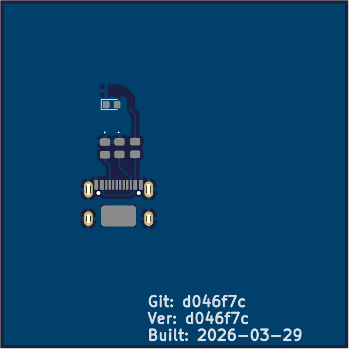
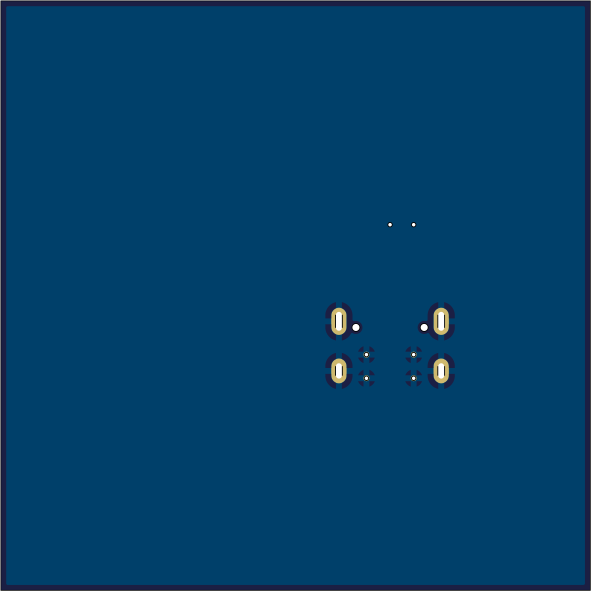
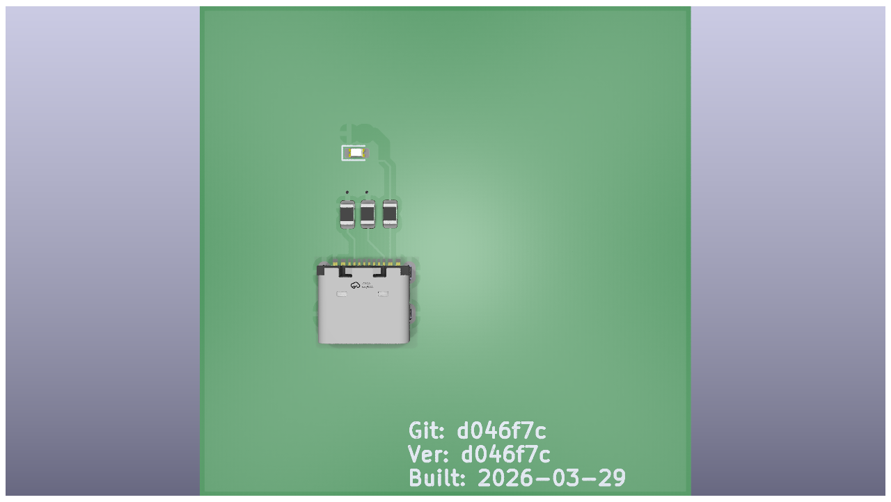
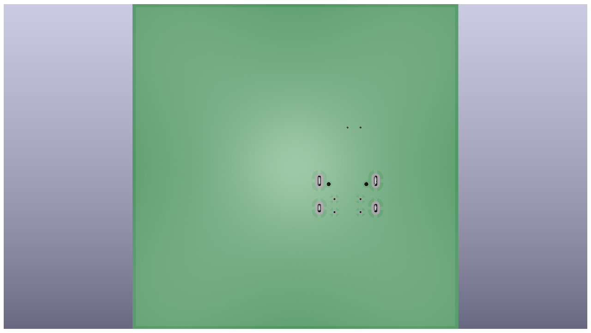

# mono-project-repo-ci-template

## Hardware Status

## Firmware Status

## PCB Renders

<!-- PCB_RENDERS_START -->

## pcb_1
| 2D Top | 2D Bottom |
|--------|----------|
|  |  |

| 3D Top | 3D Bottom |
|--------|----------|
|  |  |

<!-- PCB_RENDERS_END -->